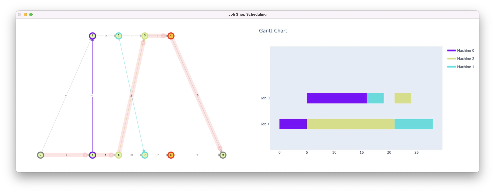

<div id="top"></div>

<!-- PROJECT LOGO -->
<br />
<div align="center">
  <a>
    
  </a>

  <h3 align="center">
     Graph Job Shop Problem Gym Environment 
  </h3>

</div>


<div align="center">
  <a>
    
  </a>
</div>


## About The Project
This provides an implementation [OpenAi Gym Environment](https://gym.openai.com/) 
of the Job Shop Scheduling Problem (JSP) using the disjunctive graph approach.
The environment offers multiple visualisation options, some of which are shown below 

<div align="center">
  <a>
    
  </a>
  <a>
    
  </a>
</div>

### Project Structure
This project is still in development and will have some significant changes before version 1.0.0.
This project ist structured according to [James Murphy's testing guide](https://www.youtube.com/watch?v=DhUpxWjOhME).


### Built With

This project uses (among others) the following libraries

* [OpenAI Gym](https://gym.openai.com/)
<!-- todo: Add all major libs-->

## Getting Started

In this Section describes the used Setup and Development tools.

### Hardware

All the code was developed and tested locally on an Apple M1 Max 16" MacBook Pro (16-inch, 2021) with 64 GB Unified Memory.

The **code** should run perfectly fine on other devices and operating Systems (see Github tests). 

### Python Environment Management

#### Mac
On a Mac I recommend using [Miniforge](https://github.com/conda-forge/miniforge) instead of more common virtual
environment solutions like [Anacond](https://www.anaconda.com) or [Conda-Forge](https://conda-forge.org/#page-top).

Accelerate training of machine learning models with TensorFlow on a Mac requires a special installation procedure, 
that can be found [here](https://developer.apple.com/metal/tensorflow-plugin/).
However, this repository provides only the gym environment and no concrete reinforcement learning agents.
Todo: example project with sb3 and rl


Setting up Miniforge can be a bit tricky (especially when Anaconda is already installed).
I found this [guide](https://www.youtube.com/watch?v=w2qlou7n7MA) by Jeff Heaton quite helpful.

#### Windows

On a **Windows** Machine I recommend [Anacond](https://www.anaconda.com), since [Anacond](https://www.anaconda.com) and 
[Pycharm](https://www.jetbrains.com/de-de/pycharm/) are designed to work well with each 
other. 

### IDEA

I recommend to use [Pycharm](https://www.jetbrains.com/de-de/pycharm/).
Of course any code editor can be used instead (like [VS code](https://code.visualstudio.com/) 
or [Vim](https://github.com/vim/vim)).

This section goes over a few recommended step for setting up the Project properly inside [Pycharm](https://www.jetbrains.com/de-de/pycharm/).

#### PyCharm Setup
1. Mark the `src` directory as `Source Root`.
```
   right click on the 'src' -> 'Mark directory as' -> `Source Root`
```

2. Mark the `resources` directory as `Resource Root`.
```
   right click on the 'resources' -> 'Mark directory as' -> `Resource Root`
```

3. Mark the `tests` directory as `Test Source Root`.
```
   right click on the 'tests' -> 'Mark directory as' -> `Test Source Root`
```

afterwards your project folder should be colored in the following way:

<div align="center">
  <a>
    
  </a>
</div>

4. (optional) When running a script enable `Emulate terminal in output console`
```
Run (drop down) | Edit Configurations... | Configuration | ☑️ Emulate terminal in output console
```

<div align="center">
  <a>
    
  </a>
</div>
### Usage


### Development 

To run this Project locally on your machine follow the following steps:

1. Clone the repo
   ```sh
   git clone https://github.com/Alexander-Nasuta/graph-jsp-env.git
   ```
2. Install the python requirements_dev packages. `requirements_dev.txt` includes all the packages of
specified `requirements.txt` and some additional development packages like `mypy`, `pytext`, `tox` etc. 
    ```sh
   pip install -r requirements_dev.txt
   ```
3. Install the modules of the project locally. For more info have a look at 
[James Murphy's testing guide](https://www.youtube.com/watch?v=DhUpxWjOhME)
   ```sh
   pip install -e .
   ```

## Testing

For testing make sure that the dev dependencies are installed (`requirements_dev.txt`) and the models of this 
project are set up (i.e. you have run `pip install -e .`).  

Then you should be able to run

```sh
mypy src
```

```sh
flake8 src
```

```sh
pytest
```

or everthing at once using `tox`.

```sh
tox
```

## PyPi 
This [guide](https://realpython.com/pypi-publish-python-package/) was used for the PypPi publishing process.

## License

Distributed under the MIT License. See `LICENSE.txt` for more information.

<!-- MARKDOWN LINKS & IMAGES todo: add Github, Linked in etc.-->
<!-- https://www.markdownguide.org/basic-syntax/#reference-style-links -->
[screenshot]: resources/readme_images/screenshot.png


