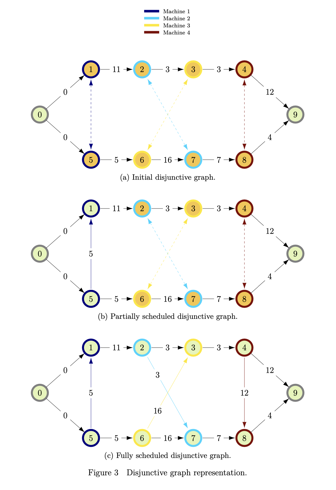
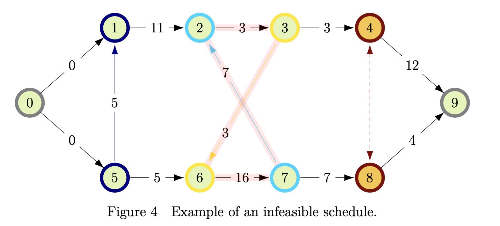
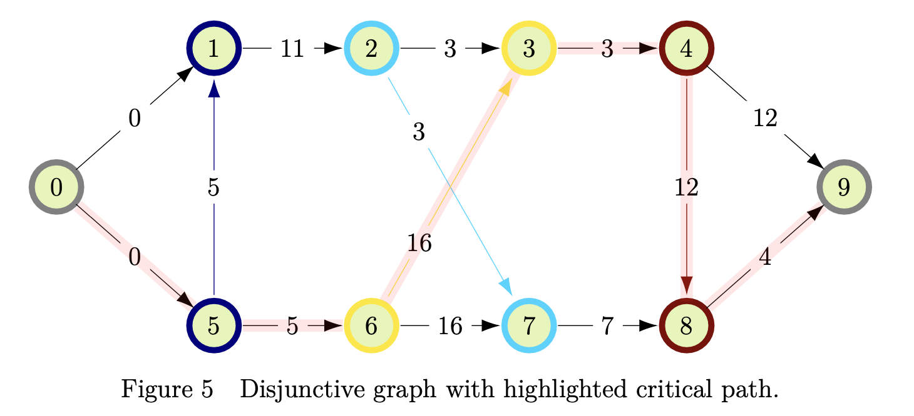

# Disjunctive Graph Formulation

```{eval-rst}
For the JSP, two common modelings exist in the literature: the modeling as a mixed integer program according to :cite:t:`manne1960job`, and the formulation as a disjunctive graph, first formulated by :cite:t:`roy1964problemes` :cite:t:`blazewicz2019handbook`.
For the latter, :cite:t:`blazewicz2000disjunctive` have developed a problem-specific efficient data structure.
The disjunctive graph formulation is the most widely used representation of the JSP and is applied in this software package.
```

A disjunctive graph $G$ consists of a set of nodes $V$, a set of directed edges $A$, and a set of undirected edges $E$.

\begin{equation}
G = (V,A,E)
\end{equation}

Figure 3 shows the example from the previous section as a directed graph.
The following paragraphs elaborate on the graph's components $V$, $A$ and $E$, and demonstrate the scheduling process.
$V$ are nodes in the graph and represent tasks.
$A$ are directed edges and indicate which task is executed prior to another task.
$E$ are undirected edges where the execution order is still to be determined.
In a nutshell, scheduling a graph means turning undirected edges into directed edges.



The set of nodes $V$ is composed of the set of tasks $\mathcal{T}$ and two fictitious nodes, the source $0$ and the sink $\star$.

\begin{equation}
V = \mathcal{T} \cup \{0,\star\}
\end{equation}

The index of the source is $0$, and the index of the sink is $N+1$.
In the disjunctive graph representation, tasks are often not indexed twice like in the previous section but consecutively.
For the example this means that task $T_{1,2}$ obtains the index 2 ($T_{2}$) and $T_{2,2}$ the index 6 ($T_{6}$).
The index of a task of disjunctive graph representation $\hat{i}$ can be obtained for JSP instances of dimension $N \times M$  by the following calculation:

\begin{equation}
T_{\hat{i}} = n \cdot j + i
\end{equation}

Analogously, one can determine $j$ and $i$ from $\hat{i}$ by integer division with remainder:

\begin{equation}
j = \left\lfloor \frac{\hat{i}}{M} \right\rfloor + 1
\end{equation}
\begin{equation}
i = \hat{i} \bmod M
\end{equation}

For the example, $V$ results in $V = \{0, 1, \ldots, 8, 9\}$ (cf. Figure \ref{ch02:fig:jsp_example_graph}), with $9$ being the sink task.


$A$ is the set of directed edges representing the sequence relations in the jobs.
$(\hat{i}, \hat{j}) \in A$ means that $T_{\hat{i}}$ is the immediate predecessor of $T_{\hat{j}}$ within a job.
With other words: task $T_{\hat{j}}$ is executed after $T_{\hat{i}}$.
These edges are called conjunctive edges.
Directed edges from the source connect to the first operations in each of the jobs.
In the example these are the edges $(0,1)$ and $(0,5)$.
Furthermore, an edge leads from each last task of a job to the sink.
$(4,9)$ and $(8,9)$ are the corresponding edges in the example.
All these edges also belong to the set $A$.
Typically, the edges of a directed graph are weighted by the duration of a task, as shown in {cite}`blazewicz2000disjunctive`.
In this case the weight $p_{\hat{i}}$ is assigned to $(T_{\hat{i}},T_{\hat{i}-1})$.
Or in other words, the weight of a directed edge is always equal to the duration of the task associated with the node it originates from.
The edge $(1,2)$ maps from $T_1$ to $T_2$. The duration of $T_1$ is $p_1 = 11$, so the weight of edge $(1,2)$ is $11$.
Occasionally one can also find formulations in which the nodes are weighted, cf. {cite}`henning2002praktische,zhang2020learning`.
However, the resulting optimization problem and its equations remain the same.

For each pair of tasks processed on the same machine, an undirected edge is initially inserted into the graph.
These edges are called disjunctive edges.
In figure \ref{ch02:fig:jsp_example_graph}, these are represented by dashed lines.
The edges are colored here additionally in the color of the corresponding machine. Furthermore, the nodes are outlined with the color of the machine that belongs to the specific task.
Coloring is not formally required and only serves clarity here.
All disjunctive edges, associated with an specific machine $k$ constitute the set $E_k$ and all disjunctive form the set $E$.
In Figure 3 $E$ corresponds to all dashed edges, whereas $E_k$ is the set of all dashed edges of a specific color.

To obtain a valid schedule, all undirected edges must be transformed into directed ones.
For each undirected edge in $E$ one has to decide in which direction it points and whether this edge shall be present in the final schedule.
The orientation must be such that the graph remains cycle-free.
Cycles in a graph lead to infeasible schedules as illustrated exemplary in Figure 4.
The constructed cycle is highlighted in red.
Directed edges indicate the processing order of tasks.
Therefore $T_6$ must be executed after  $T_3$, $T_3$ after $T_2$, and $T_2$ after $T_7$.
The edge (6,7) requires $T_7$ to be executed after $T_6$, which is a contradiction.



The start times for the tasks are denoted by $s_{\hat{i}}$ with $\hat{i} \in V$.
These start times result from the longest path from the source to node $T_{\hat{i}}$, with the start time of the source being 0.
This also holds for the fictional introduced sink node.
In the example the $T_5$ has the start time $s_5=0$ and $T_1$ has the start time $s_1=5$, since the longest path from $T_0$ to $T_1$ is $\{(0,5),(5,1)\}$.
A task can only be executed if all preceding tasks in a job have been completed and the associated machine is available.
The fact that both conditions must hold, manifests itself in the longest path.
In principle, $T_1$ could be processed immediately since its predecessor $T_0$ has been processed completely.
However, $T_1$ must wait until machine $M_1$ is available.
The source task $T_0$ and the sink task $T_9$ can be thought of as start and end tasks within a schedule.
The start time happens to be the time at which all tasks and jobs are done.
Thus, the makespan $C_{max}$ in this representation results in the longest path in the graph; the path from the source to the sink.
The longest path in a graph is also called critical path, since it determines the makespan.
In Figure 5 the critical path for the given example is highlighted.




The discrete optimization problem for minimizing the makespan $C_{max}$ formally can be stated as follows {cite}`blazewicz2019handbook, henning2002praktische`:

$$
\begin{flalign}
s_{\hat{j}} - s_{\hat{i}} &\geq p_{\hat{j}} &\;& \forall \hat{i},\hat{j} \in V, (\hat{i},\hat{j}) \in A &\;(sequence \; constraint)
\\
\label{ch02:eq:jsp_start_const}
s_{\hat{j}} &= 0 &\;& \forall \hat{j} \in V &\;(start\;time\;constraint)
\\
\label{ch02:eq:capacity}
s_{\hat{j}} - s_{\hat{i}} &\geq p_{\hat{j}} \lor s_{\hat{i}} - s_{\hat{j}} \geq p_{\hat{i}} &\;& \forall \hat{i},\hat{j} \in V, (\hat{i},\hat{j}) \in E_k \forall k \in \mathcal{M}\ &\;(capacity\;constraint)
\end{flalign}
$$


The first Equation ensures the sequence of all tasks within a job is followed.
For example the start time $s_3$ of task $T_3$ has to be at least $p_2=3$ time units later that $s_2$.
The third Equation demands that only one job is processed at a time on a machine.
This equation formalizes taking the longest path to a node to determine its start time, as elaborated above.
Finally second Equation ensures that all tasks are executed (with an associated positive start time).

