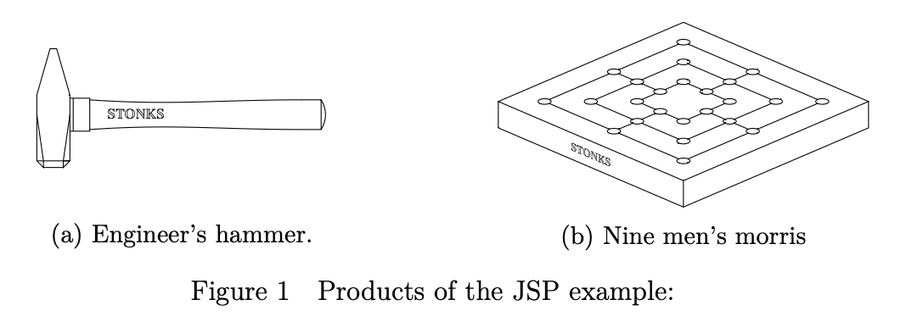
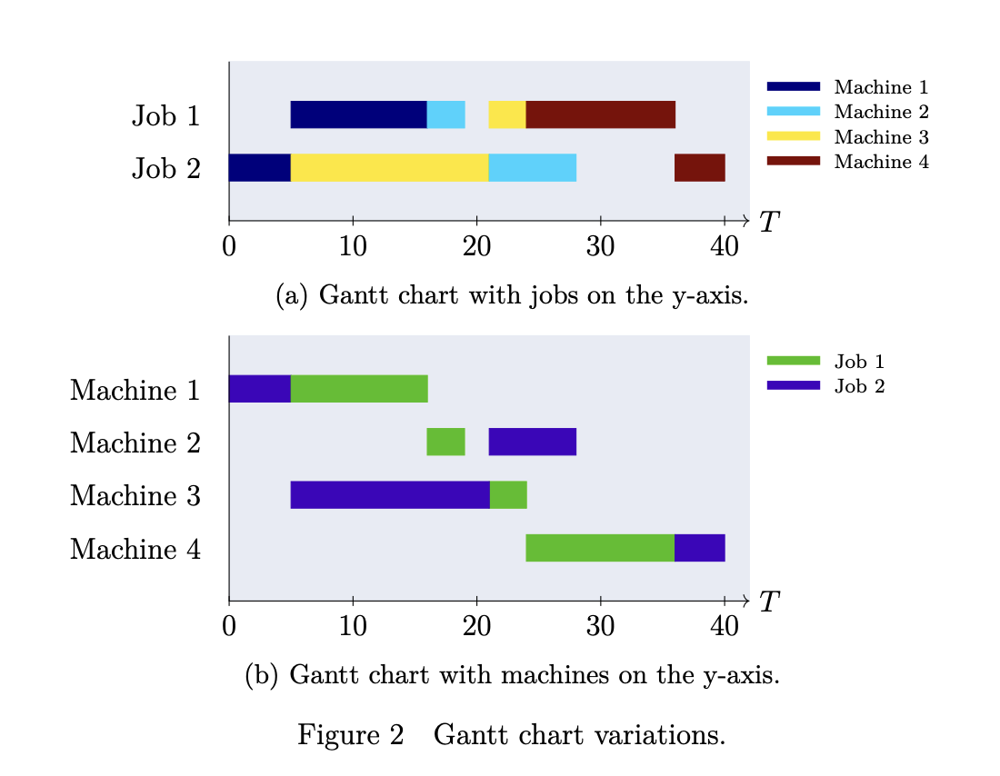

## Job Shop Scheduling

In this section, the JSP is formally defined and concurrently explained by a minimalistic example, the scheduling of the production of a *nine men's morris* game and an *engineer's hammer*.
Figure 1 illustrates these two products.



The JSP consists of a set of jobs $\mathcal{J} = {\{J_j\}}_{j=1}^{n}$ that needs processing on a set of machines $\mathcal{M} = {\{M_i\}}_{i=1}^{m}$.
Each job $J_j$ consists of a set of $m_j$ operations $\mathcal{T} = \{T_{j,1}, T_{j,2},...,T_{j,m_j}\}$, also called tasks {cite}`henning2002praktische`.
In the given case, the jobs are an engineer's hammer ($J_1$) and a nine men's morris game ($J_2$).
Both jobs are composed of similar tasks *cutting*, *drilling*, *milling* and *grinding*, although in different order.
The individual tasks have to be executed on corresponding machines.
For example, the operation *cutting* requires execution on the machine *band saw* ($M_1$).
The operation *cutting* in both jobs is not the same operation but is carried out on the same machine.
Task $T_{j,i}$ corresponds to job $J_j$ and must be processed on machine $M_i$ for an uninterrupted duration $p_{j,i}$.
{ref}`table-sequence-job` shows the sequences of tasks for each job and {ref}`table-2` provides an assignment of all operations, machines and their processing durations in the given case.
Furthermore, {ref}`table-2` contains an alternative consecutive indexing of the tasks $T_{\hat{i}}$, which will be introduced later.

```{table} Table 1
:name: table-sequence-job

| **Engineer’s Hammer ($J_1$)** | **Nine Man Morris ($J_2$)** |
|-------------------------------|----------------------------|
| cutting ($T_{1,1}$)           | cutting ($T_{2,1}$)        |
| drilling ($T_{1,2}$)          | milling ($T_{2,3}$)        |
| milling ($T_{1,3}$)           | drilling ($T_{2,2}$)       |
| grinding ($T_{1,4}$)          | grinding ($T_{2,4}$)       |
```

```{table} Table 2
:name: table-2
| **task $T_{i,j}$** | **task $T_{\hat{i}}$**     | **task description**       | **job $J_j$** | **machine $M_i$** | **machine description**     | **duration $p_{i,j}$** |
|-----------|---------------|-----------------|---------------|--------------|------------------|------------------------|
| $T_{1,1}$ | $T_1$         | cutting         | $J_1$         | $M_1$        | band saw         | 11                     |
| $T_{1,2}$ | $T_2$         | drilling        | $J_1$         | $M_2$        | drill press      | 3                      |
| $T_{1,3}$ | $T_3$         | milling         | $J_1$         | $M_3$        | milling machine  | 3                      |
| $T_{1,4}$ | $T_4$         | grinding        | $J_1$         | $M_4$        | grinding machine | 12                     |
| $T_{2,1}$ | $T_5$         | cutting         | $J_2$         | $M_1$        | band saw         | 5                      |
| $T_{2,3}$ | $T_6$         | milling         | $J_2$         | $M_3$        | milling machine  | 16                     |
| $T_{2,2}$ | $T_7$         | drilling        | $J_2$         | $M_2$        | drill press      | 7                      |
| $T_`{2,4}$ | $T_8$         | grinding        | $J_2$         | $M_4$        | grinding machine | 4                      |
```

In addition to the requirements for the order of the machines within a job, a JSP must fulfill the following constraints {cite}`henning2002praktische`.:

- The processing of a task is not allowed to be interrupted and resumed at a later point in time.
- Each machine can process only one operation at a time.
- Two operations of the same job cannot be simultaneously processed.
- The processing time of each operation does not depend on the processing sequence of the machines.
- Transport times between the machines and set-up times are not considered.
- All machines are always available from time 0. Jobs can start at time 0.
- There are no parallel machines or machine groups.
- All jobs have the same priority.
- There are no release or due dates for the jobs. Idle times on the machines and waiting times in the jobs are permissible.


A solution of the JSP, a feasible schedule, assigns a start time $s_{j,i}$ to each task $T_{j,i}$ such that none of the constraints above is violated.
Similar to other scheduling problems, the goal is to minimize an objective function.
In the classical JSP, which this thesis examines, this objective function is the makespan.
Minimizing the makespan means finding a schedule that requires minimum time for processing all jobs.
In other words, the last task in a schedule has to finish as early as possible.
Using the notation introduced above, it is defined as:
\begin{equation}
C_{max} = max(s_{j,i}+p_{j,i})
\end{equation}

Commonly, the dimension of a JSP instance is denoted by $n \times m$, with $m$ being the number machines and $n$ being the number of jobs.
In this case, $m_j = m$ for all $J_j \in \mathcal{J}$ {cite}`henning2002praktische`.
In other words: every job uses every machine.
This does not necessarily have to be the case; however, one can transfer any JSP into this dimension by adding tasks with processing duration 0 for all machines that are not used in a job.


A widely used way of visualizing a JSP is the Gantt chart.
Time is plotted on the x-axis, whereas machines or jobs are listed on the y-axis.
Time blocks in the diagram then represent the individual tasks.
If the y-axis represents jobs, colors are assigned to machines, and each time block is colored in the corresponding machine's color.
When machines are plotted on the y-axis, it is the other way around.
Figure 2 shows both Gantt chart variations for an optimal solution of the JSP example.


