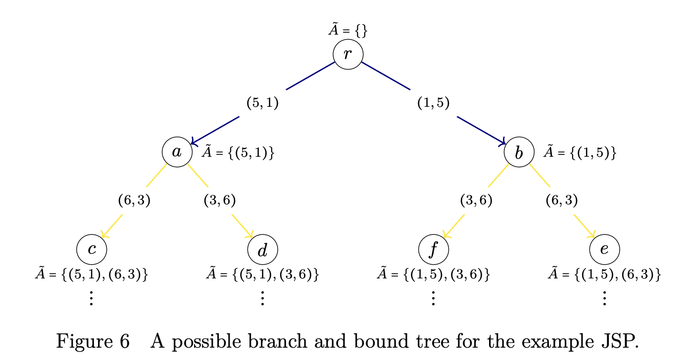
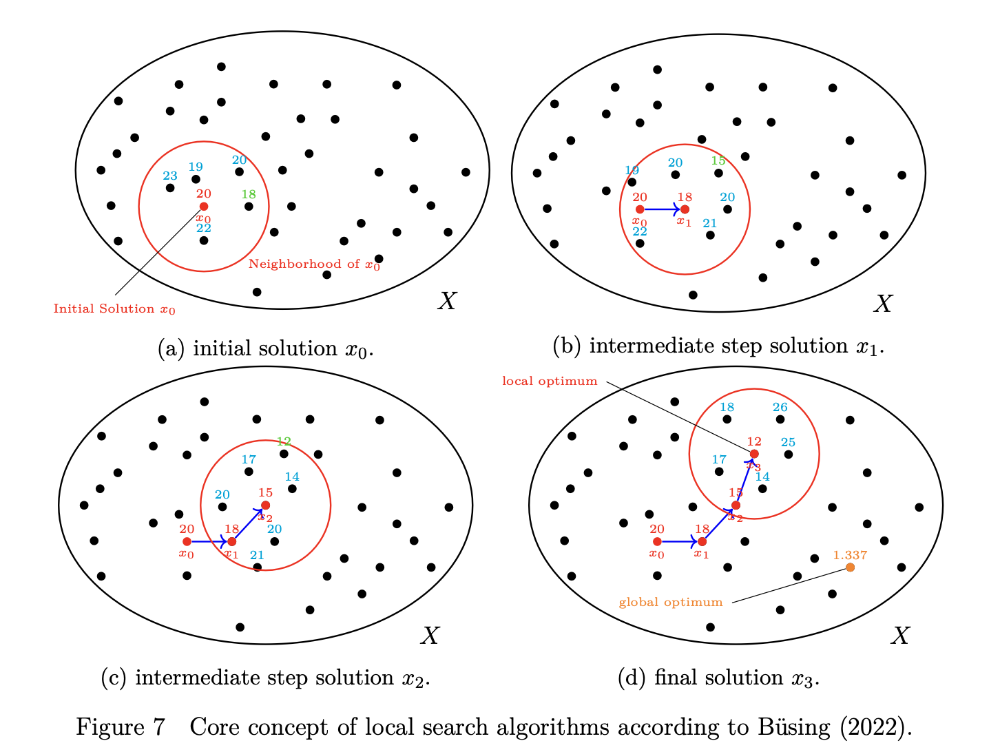

# Solution Methods for the Job Shop Problem

Optimization problems, like the JSP, can be solved with two classes of methods: exact and approximation methods.
Exact methods provide solutions that are guaranteed to be optimal.
Approximation methods claim to provide a good solution, which may or may not be optimal. Some approximation methods provide an estimation, which allows a statement about the quality of the solution, e.g. the solution is worse by a factor of 1.5 with respect to the quality criterion than the optimal solution.
Others only provide empirically good solutions and do not offer any formal guarantees.
In the following sections, solution methodologies relevant for the JSP are introduced briefly.

## Exact methods

The main idea behind commonly used exact methods is to arrange all possible solutions in a tree structure.
The original problem is broken down into smaller problems until they are sufficiently small that one can evaluate them well {cite}`talbi2009metaheuristics`.
For the JSP, the *branch and bound* method is the most widely used approach {cite}`blazewicz2019handbook`.
Figure 6 illustrates one way to organize the solutions of a JSP into a tree structure, using the example from the previous sections.
Each level indicates how a disjunctive edge was oriented.
The graph has initially $4$ disjunctive edges, resulting in a tree with $4$ layers and $2^4=16$ leaves.
Each node represents an oriented graph.
For instance node $r$ represents Figure 3a and node $a$ Figure 3a.
For large JSP instances, the tree becomes very large, so considering all paths in the tree is not efficient.
This would be equivalent to a brute force approach.
Instead, the branch and bound approach looks at individual subtrees and estimates how good or bad the solutions within the subtrees are.
One might recognize that subtree $b$ leads to worse solutions than subtree $a$ and not consider any branches that emerge from $b$.



```{eval-rst}
Estimations of a subtree can be done, for example, by not considering some assumptions of the JSP, thus making the problem simpler and allowing a statement about the minimum and maximum makespan.
:cite:t:`applegate1991computational` developed such a method, which is considered to be one of the most efficient.
:cite:t:`blazewicz2019handbook` provides a good overview of further branch and bound methods for the JSP.

A major drawback of branch and bound methods is the lack of strong lower bounds to cut off the branches of the enumeration tree early :cite:p:`blazewicz2019handbook`.
Therefore, these methods are very computationally intensive and not suitable for large JSP instances.
```


## Approximation Methods

Common approximation methods used in JSP are heuristics.
Heuristics aim to find suitable solutions in a reasonable amount of time.
The naming "heuristic" itself is derived from the Greek phrase "I found it" hinting at the intended low time complexity of heuristics.
For JSPs there are two types of heuristics: problem specific heuristics and metaheuristics.
Problem specific heuristics are specifically designed to solve JSP instances, whereas metaheuristics are general-purpose algorithms that can be applied to solve almost any optimization problem.

Examining the JSP example from section \ref{ch:02:sec:jsp}, the first issue that arises is whether to process $T_1$ or $T_5$ first.  
Both tasks must be processed on machine $M_1$ and are directly available from time $0$.
This represents a conflict for the resource $M_1$.
The algorithm of Giffler-Thompson is a procedure on how to resolve such conflicts.
Each time a conflict occurs, a so-called priority rule is used to determine which task should run first on the machine.
Whereas one priority rule might favor a task randomly, another might choose the task associated with the longest processing time.
This approach is problem specific and therefore represents a problem specific heuristic.


*Local Search* is the most common metaheuristic for solving JSPs and forms a family of specific algorithms.
The core concept consists of starting from an initial solution and iteratively examining neighboring solutions until further iteration no longer yields an improvement.
Figure \ref{ch:02:fig:localSearch} shows a schematic illustration of this procedure.
The initial solution can be a trivial solution or may be obtained by a problem-specific heuristic.




```{eval-rst}
It becomes obvious that local search only finds a local optimum and not necessarily a global one.
For the application of this metaheuristic, a neighborhood operator must be defined for the JSP.
This operator ultimately determines whether and to what extent two solutions are adjacent.
The concrete algorithm ultimately determines the size of the chosen neighborhood and whether all neighbors are examined or just a few.
The most successful local search methods for the JSP are *Tabu Search* and *Simulated Annealing*.
:cite:t:`blazewicz2019handbook` covers neighborhood definitions and algorithms in detail and introduces further metaheuristics.

Due to their low time complexity, heuristics are mainly used for solving large instances :cite:t:`blazewicz2019handbook`.
```

## Reinforcement Learning for Solving Scheduling Problems

Solution algorithms for machine scheduling problems are often designed for specific optimization functions and constraints.
In real production environments, there are often a variety of metrics that require optimization, for example, the makespan, tardiness, and individual job processing times.
However, many solution algorithms are designed to optimize single metrics.
Reinforcement learning (RL), is, in principle, able to consider multiple metrics.
This can be achieved by designing the reward function accordingly.
RL can also optimize metrics not trivially related to scheduling, such as key performance indicators {cite}`waubert2022reliability`.
In RL, actions are taken based on observations.
This allows RL agents to react to changing conditions.
In real applications, even non-obvious correlations, such as the effect of the weather on the production process, can thereby be implicitly captured {cite}`waubert2022reliability`.   
Although such complex interactions could, in principle, be captured by RL, relatively simple metrics, such as the makespan, are still primarily investigated in the literature.

